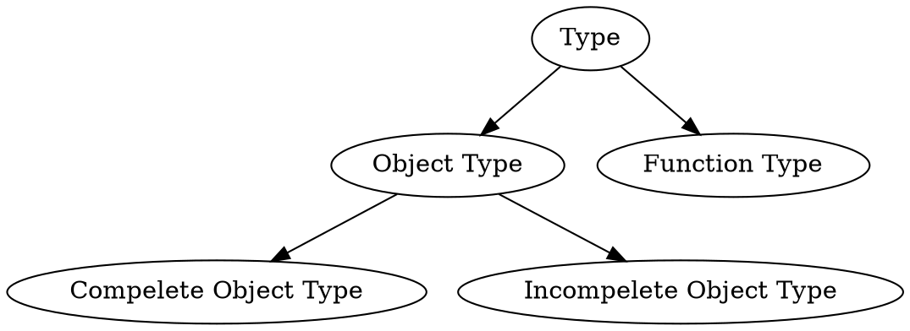
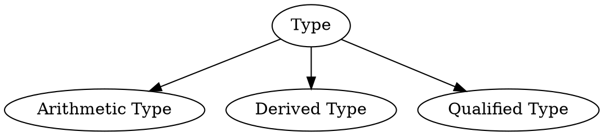
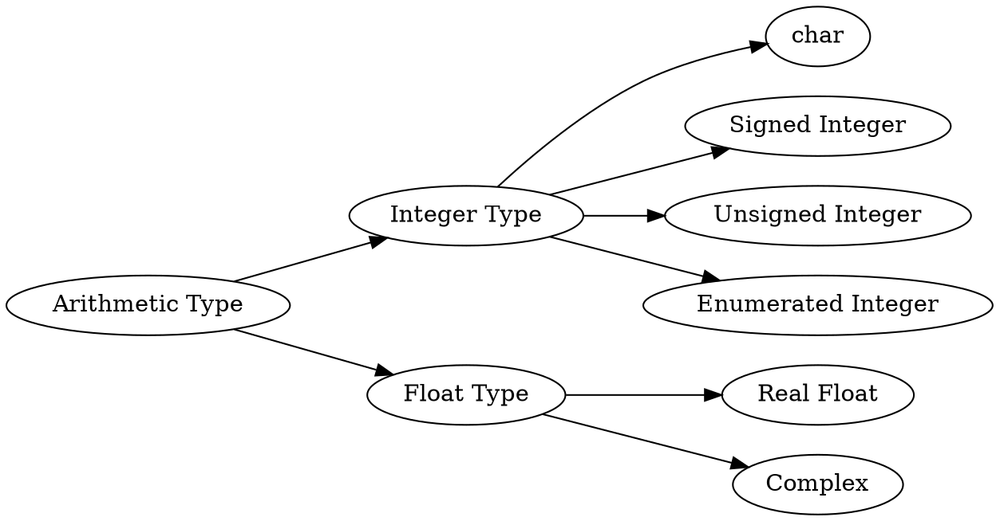

# 对象类型：算术类型

[@Bili: BV1Xy411q7SZ](https://www.bilibili.com/video/BV1Xy411q7SZ)


## 类型的分类

第一种分类方式：



第二种分类方式：





## 对象类型 `T` 及其大小与对其要求

> `T`：C 语言任何一个**对象类型**的形式化定义

- **`sizeof(T)`**：规定了一个 `T` 类型的对象的大小是多少（**不完全类型没有 size**），其实是对象的**字节个数**
- **`alignof(T)`**：规定了一个 `T` 类型的对象缺省对齐要求是多少（对象的对齐要求可变），对齐要求是要求**对象地址**能够被**整除**

> 对象地址（Object Address）：对象所占用的连续字节中最低字节的编号
> 
> C23 之前，关键字使用 `_Alignof`，C23 开始提升为 `alignof`


## 算术类型（Arithmetic Type）

算术类型都是**完全对象类型**。大致可以分类如下：



> C23 的新变化：
> - `_Bool` 提升为 `bool`
> - 增加了指定位域个数整数类型 `_BitInt(N)` 与 `unsigned _BitInt(N)`
> - 增加了三个十进制浮点类型 `_Decimal32`，`_Decimal64` 与 `_Decimal128`


## 标准有符号整数类型

包含 5 个：`signed char`，`short int`，`int`，`long int` 与 `long long int`。

所有的 bits 可分为 3 个部分：`sign bits`，`value bits` 与 `padding bits`，但摆放位置由编译器确定。

假设对于对象类型 `T` 有 `sign bits` 的个数加上 `value bits` 的个数为 \\(N\\)，则有下面的概念：

- 宽度（Width）：\\(N\\)
- 精度（Precision）：\\(N-1\\)
- 对象值范围：\\([-2^{N-1}, 2^{N-1}-1]\\)

### 宽度定义

| 类型 | 宽度宏 | 取值要求 |
|:---:|:---:|:---:|
| `signed char` | `SCHAR_WIDTH` | `CHAR_BIT` |
| `short int` | `SHRT_WIDTH` | \\(\geqslant 8\\) |
| `int` | `INT_WIDTH` | \\(\geqslant 16\\) |
| `long int` | `LONG_WIDTH` | \\(\geqslant 32\\) |
| `long long int` | `LLONG_WIDTH` | \\(\geqslant 64\\) |

- 书写类型表示值范围时，应使用诸如 `SCHAR_MIN` 与 `SCHAR_MAX` 的宏，而非直接书写数字。
- `signed char` 类型不允许有 `padding bits`，因此 `sizeof(signed char)` 一定为 1；其他四种标准有符号整数类型没有明确规定 `padding bits`，但一般可以假设没有。

> `typedef` 的用法：`typedef T alias`，为类型 `T` 设置别名。通过 `typedef` 可以提高程序的可移植性，比如：
> ```c
> #ifdef ImplA
>     typedef short int INT16;
>     typedef int INT32;
> #elifdef ImplB
>     typedef int INT16;
>     typedef long int INT32;
> #endif
> ```

> C23 中指定位域的类型 `_BitInt(N)`，指定有符号整数类型的宽度为 `N`，该类型的对象的对象值范围为 \\([-2^{N-1}, 2^{N-1}-1]\\).
> 
> 该类型可能会有 `padding bits`，个数为：`sizeof(_BitInt(N)) * CHAR_BIT - N`.


## 标准无符号整数类型

除了五种标准有符号整数类型，还有一个 `bool` 类型（C23 以前为 `_Bool`）。

对于标准无符号整数类型 `T` 的对象，bits 被分为两部分：`value bits` 与 `padding bits`，摆放位置同样由编译器确定。

对象类型 `T` 的宽度 \\(N\\) 同样也是其精度，其对象的对象值范围为 \\([0, 2^N-1]\\).


### 宽度定义

| 类型 | 宽度宏 | 取值要求 |
|:---:|:---:|:---:|
| `unsigned char` | `UCHAR_WIDTH` | `CHAR_BIT` |
| `unsigned short int` | `USHRT_WIDTH` | \\(\geqslant 8\\) |
| `unsigned int` | `UINT_WIDTH` | \\(\geqslant 16\\) |
| `unsigned long int` | `ULONG_WIDTH` | \\(\geqslant 32\\) |
| `unsigned long long int` | `ULLONG_WIDTH` | \\(\geqslant 64\\) |
| `bool` | `BOOL_WIDTH` | \\(1\\) |

- `bool` 类型宽度为 1，表征 `true` 和 `false` 两个值，但是其 `size` 由编译器决定，一定会有 `padding bits`，个数为：`sizeof(bool) * CHAR_BIT - 1`.


## 对齐要求

对象的对齐要求一定是 \\(2^n\\) 的值，如 \\(1,2,4,8,\cdots\\)，值越小，称为**对齐要求越弱**（weak），反之则**越强**（strong）。

标准规定，`signed char` 与 `unsigned char` 的对齐要求是最弱的，但不一定是 \\(1\\).


## 枚举类型

枚举类型由程序员定义，实际的**实现类型**（**Underlying Type**）有两种方式确定：

- 指定实现类型（Fixed Underlying Type）：
  - 定义时指定：`enum Season : int {Spring, Summer, Autumn, Winter}`
  - 自 C23 始可用
- 由编译器自动设置为下列 5 种整数类型之一：
  - `char`
  - 标准 {有 | 无} 符号整数类型
  - 扩展 {有 | 无} 符号整数类型


## `char` 类型

`char`、`signed char` 与 `unsigned char` 是**三种不同的类型**！它们统称为**字符类型**（Character Type）。

编译器会指定 `char` 与其中一种行为一致。
